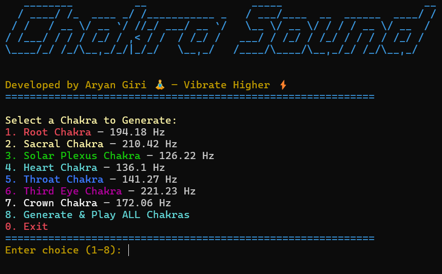

# Chakra_Sound  


## 🕉️ About the Project
**Chakra_Sound** is a terminal-based vibrational healing tool that generates pure frequency tones corresponding to the seven chakras of the human energy system.  
Each sound is tuned to resonate with a specific chakra — restoring balance, promoting mindfulness, and deepening your meditation experience.  

Built in Python with love and ancient wisdom 🌸  

---

## ✨ What Are Chakras?

In the ancient spiritual traditions of **India**, chakras are considered **energy centers** located along the spine that govern different physical, emotional, and spiritual aspects of life.  
The term *“chakra”* (चक्र) means *“wheel”* or *“disk”* in Sanskrit — symbolizing rotating energy vortices that keep our body, mind, and spirit aligned.  

Balancing these chakras through meditation, yoga, and sound therapy helps harmonize your inner self and connect with the universe’s divine flow.

| Chakra Name | Sanskrit Name | Location | Frequency (Hz) | Element | Purpose |
|--------------|---------------|-----------|----------------|----------|----------|
| Root Chakra | Muladhara | Base of spine | **194.18 Hz** | Earth | Stability, security, grounding |
| Sacral Chakra | Svadhisthana | Below navel | **210.42 Hz** | Water | Creativity, emotions, sexuality |
| Solar Plexus Chakra | Manipura | Stomach area | **126.22 Hz** | Fire | Confidence, power, will |
| Heart Chakra | Anahata | Center of chest | **136.10 Hz** | Air | Love, compassion, healing |
| Throat Chakra | Vishuddha | Throat | **141.27 Hz** | Ether | Expression, truth, communication |
| Third Eye Chakra | Ajna | Between eyebrows | **221.23 Hz** | Light | Intuition, awareness, insight |
| Crown Chakra | Sahasrara | Top of head | **172.06 Hz** | Thought | Consciousness, unity, divine connection |

---

## 🎧 How It Works
Each chakra corresponds to a unique vibration. When these specific frequencies are played, they stimulate the associated energy centers, cleansing blockages and restoring flow.  
Listening to these tones during meditation or yoga can:
- Calm your mind and reduce stress 🧘‍♂️  
- Increase focus and awareness 🪷  
- Promote emotional balance and healing 💖  
- Strengthen your spiritual connection 🌌  

---

## ⚙️ Features
- 🎵 Play individual chakra tones by selecting 1–7  
- 🔁 Play all chakra tones sequentially for a full-body alignment  
- ⏱️ Customize frequency and duration  
- 🌈 Colorful terminal interface using `pyfiglet`, `termcolor`, and `colorama`  

---

## 🪶 Installation
1. Clone or download this repository.
   ```
   git clone https://github.com/giriaryan694-a11y/Chakra_Sound
   ```
3. Open a terminal in the project directory.
   ```
   cd Chakra_Sound
   ```
5. Install required dependencies:
   ```bash
   pip install -r requirements.txt
   ```
6. Run
   ```
   python main.py
   ```

## 🌸 Usage Tips
  *Use headphones or a quiet space for best experience.*
  *Sit in a comfortable meditation posture and focus on the chakra area while the sound plays.*
  *Visualize the chakra’s color (e.g., red for Root, green for Heart).*
  *Practice deep breathing to enhance the vibrational effect.*

## 📜 Credits
 - Inspired by the ancient Indian science of energy healing and modern sound frequency research.
 - Developed by Aryan with guidance from the spirit of knowledge — combining tradition with technology.

## ⚠️ Disclaimer
- This tool is for spiritual and educational purposes only.
- It is not a substitute for medical treatment or therapy. Always consult qualified professionals for physical or psychological concerns.

**🌟 “When the inner sound aligns with universal vibration, the soul awakens.”**
